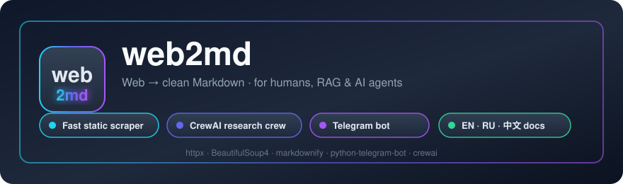
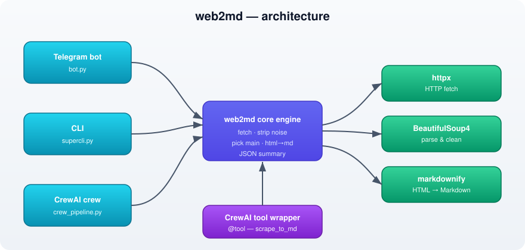

<div align="center">



# web2md

**Turn any web page into clean Markdown — for humans, RAG and AI agents.**

A lightweight, dependency-light scraper that fetches a page, strips navigation / ads / boilerplate and returns the **main content as Markdown**.

[](https://www.python.org/)
[](LICENSE)
[](#-telegram-bot)
[](#-crewai-crew)

⭐ Fast static scraper · 🤖 Telegram bot · 🧠 CrewAI research crew · 🌍 EN · RU · 中文 docs

</div>

---

## 📑 Language switcher

Click a tab to read the documentation in your language. Click a section to expand it.

<details open>
<summary><b>🇬🇧 English</b></summary>

> **The problem.** Most of the web is noisy: navigation bars, cookie banners,
> ads, "related posts" and footers pollute every page. When you feed raw HTML
> to an LLM, a RAG pipeline or a human reader, that noise degrades quality and
> wastes tokens.
>
> **The value.** `web2md` extracts the *meaningful* content of any URL and
> returns clean Markdown in seconds — no browser engine (Playwright), no
> external API, no heavy dependencies. It runs on three light libraries
> (`httpx`, `BeautifulSoup4`, `markdownify`) and powers a CLI, a Telegram bot
> and a CrewAI agent crew from one shared engine.

### ✨ Features
- **Single mode**: one URL → Markdown (to console or file).
- **Batch mode**: a file of URLs → one `.md` per page + a JSON summary.
- **JSON export**: title, url, length, text.
- **Noise stripping**: `<script>`, `<style>`, `<nav>`, `<footer>`, forms, ads, cookie widgets.
- **Main-content selection**: `article`, `main`, `#content`, … or `<body>`.
- **Length cap** (`--max-len`).
- **Telegram bot**: send a URL, get Markdown back; `/summary` adds an AI briefing.
- **CrewAI crew**: a `Web Researcher` + `Content Analyst` crew that scrapes and summarizes.

### 📦 Installation
Requires Python 3.10+.

```bash
git clone https://github.com/pavelvladimirovich258614-sys/web2md.git
cd web2md
pip install -r requirements.txt
```

### 🖥️ Usage — CLI (`web2md.py`)

```bash
# to console
python web2md.py https://example.com
# to a file
python web2md.py https://example.com --out page.md
# cap length + JSON record
python web2md.py https://example.com --max-len 4000 --out page.md --json page.json
```

**Batch** — create `urls.txt` (one URL per line; `#` lines are comments):

```
https://example.com
https://en.wikipedia.org/wiki/Web_scraping
# this line is ignored
https://news.ycombinator.com
```

```bash
python web2md.py --batch urls.txt --outdir ./out --json results.json
```
Result: `out/<domain_path>.md` per page + a compact `results.json` (url, ok, title, length).

| Flag | Description |
|---|---|
| `--out FILE` | Where to write Markdown (single mode) |
| `--batch FILE` | File with a list of URLs (batch mode) |
| `--outdir DIR` | Folder for `.md` files (batch mode) |
| `--json FILE` | Write a JSON summary / record |
| `--max-len N` | Truncate output to N characters |
| `--raw` | Skip noise stripping (for debugging) |
| `--timeout S` | Request timeout in seconds (default 20) |

### 🧰 Usage — CLI wrapper (`supercli.py`)
A friendlier `click`-based wrapper over the engine (needs `click`):

```bash
python supercli.py --help
python supercli.py one <url> --out page.md
python supercli.py one <url> --json r.json
python supercli.py show <url> --max-len 1000
python supercli.py batch urls.txt --outdir ./out --json results.json
python supercli.py stats results.json
```

### 🤖 Telegram bot
The bot wraps the same engine: send a URL → get the page as Markdown.

**1. Create the bot.** In Telegram, talk to [@BotFather](https://t.me/BotFather), run `/newbot`, pick a name and username, and copy the token it gives you.

**2. Configure.** Copy `.env.example` to `.env` and set the token (and optionally an LLM key for `/summary`):

```bash
cp .env.example .env
# then edit .env:
#   TELEGRAM_BOT_TOKEN=123456:ABC...
#   OPENAI_API_KEY=sk-...        # only needed for /summary
```

**3. Run.**

```bash
python bot.py
```

**4. Use it.** Open your bot in Telegram:
- Send any URL → the page's main content as Markdown.
- `/scrape <url> [max-len]` — explicit scrape with an optional length cap.
- `/summary <url>` — scrape + AI summary (needs `OPENAI_API_KEY`, uses the CrewAI crew).
- `/help`, `/start` — help.

> The bot splits long replies into chunks (see `TG_MAX_REPLY`) and never logs your token.

### 🧠 CrewAI crew
`crew_pipeline.py` exposes the engine as a CrewAI `@tool` and runs a sequential
crew: a **Web Researcher** fetches the page to Markdown, then a **Content
Analyst** writes a faithful, non-hallucinated summary.

```bash
export OPENAI_API_KEY=sk-...
python crew_pipeline.py "https://example.com"
python crew_pipeline.py "https://example.com" --max-len 8000 --model gpt-4o-mini
```

Set `CREW_MODEL` to change the default model and `WEB2MD_MAX_LEN` / `WEB2MD_TIMEOUT`
to tune the scrape tool.

### 🏗️ Architecture & key components
<div align="center">

</div>

- **`web2md.py`** — the shared engine: `fetch` (httpx) → `strip_noise` + `pick_main` (BeautifulSoup4) → `markdownify` → clean Markdown / JSON.
- **`supercli.py`** — `click` CLI wrapper (`one`, `batch`, `show`, `stats`) over the engine.
- **`bot.py`** — Telegram front-end over the engine; `/summary` delegates to the crew.
- **`crew_pipeline.py`** — wraps the engine in a CrewAI `@tool` and orchestrates two agents.

### ⚠️ Limitations
- Static HTML only (no JS rendering). Heavy JS sites need a browser engine — a future roadmap item.
- Not all anti-bot shields are bypassed (Cloudflare/Turnstile need a heavier build).

### 📄 License
Released under the **MIT License** — see [LICENSE](LICENSE).

</details>

<details>
<summary><b>🇷🇺 Русский</b></summary>

> **Проблема.** Веб зашумлён: навигация, cookie-баннеры, реклама, «похожие
> записи» и подвалы засоряют каждую страницу. Если скармливать сырой HTML
> LLM, RAG-пайплайну или человеку — шум портит качество и сжигает токены.
>
> **Ценность.** `web2md` достаёт *смысловой* контент любого URL и за секунды
> отдаёт чистый Markdown — без браузерного движка (Playwright), без внешних
> API и без тяжёлых зависимостей. Работает на трёх лёгких библиотеках
> (`httpx`, `BeautifulSoup4`, `markdownify`) и из одного движка питает CLI,
> Telegram-бота и команду агентов CrewAI.

### ✨ Возможности
- **Одиночный режим**: один URL → Markdown (в консоль или файл).
- **Батч-режим**: файл со списком URL → по одному `.md` на страницу + сводка в JSON.
- **Экспорт в JSON**: title, url, длина, текст.
- **Чистка шума**: `<script>`, `<style>`, `<nav>`, `<footer>`, формы, реклама, cookie-виджеты.
- **Выбор основного контента**: `article`, `main`, `#content` … или `<body>`.
- **Ограничение длины** (`--max-len`).
- **Telegram-бот**: присылайте URL — получайте Markdown; `/summary` добавляет AI-краткое содержание.
- **Команда CrewAI**: связка `Web Researcher` + `Content Analyst` — скрейпит и кратко излагает.

### 📦 Установка
Нужен Python 3.10+.

```bash
git clone https://github.com/pavelvladimirovich258614-sys/web2md.git
cd web2md
pip install -r requirements.txt
```

### 🖥️ Использование — CLI (`web2md.py`)

```bash
# в консоль
python web2md.py https://example.com
# в файл
python web2md.py https://example.com --out page.md
# ограничить длину + JSON-запись
python web2md.py https://example.com --max-len 4000 --out page.md --json page.json
```

**Батч** — создайте `urls.txt` (по одному URL на строку; строки с `#` — комментарии):

```
https://example.com
https://en.wikipedia.org/wiki/Web_scraping
# это комментарий, пропускается
https://news.ycombinator.com
```

```bash
python web2md.py --batch urls.txt --outdir ./out --json results.json
```
Результат: `out/<домен_путь>.md` для каждой страницы + компактный `results.json` (url, ok, title, длина).

| Флаг | Описание |
|---|---|
| `--out FILE` | Куда писать Markdown (одиночный режим) |
| `--batch FILE` | Файл со списком URL (батч-режим) |
| `--outdir DIR` | Папка для `.md`-файлов (батч-режим) |
| `--json FILE` | Записать JSON-сводку/запись |
| `--max-len N` | Обрезать вывод до N символов |
| `--raw` | Не чистить шум (для отладки) |
| `--timeout S` | Таймаут запроса, сек (по умолчанию 20) |

### 🧰 Использование — CLI-обёртка (`supercli.py`)
Удобная обёртка на `click` поверх движка (нужен `click`):

```bash
python supercli.py --help
python supercli.py one <url> --out page.md
python supercli.py one <url> --json r.json
python supercli.py show <url> --max-len 1000
python supercli.py batch urls.txt --outdir ./out --json results.json
python supercli.py stats results.json
```

### 🤖 Telegram-бот
Бот оборачивает тот же движок: присылайте URL — получаете страницу в виде Markdown.

**1. Создайте бота.** В Telegram напишите [@BotFather](https://t.me/BotFather), выполните `/newbot`, выберите имя и username и скопируйте выданный токен.

**2. Настройте.** Скопируйте `.env.example` в `.env` и впишите токен (и при желании ключ LLM для `/summary`):

```bash
cp .env.example .env
# затем отредактируйте .env:
#   TELEGRAM_BOT_TOKEN=123456:ABC...
#   OPENAI_API_KEY=sk-...        # нужен только для /summary
```

**3. Запустите.**

```bash
python bot.py
```

**4. Используйте.** Откройте бота в Telegram:
- Пришлите любой URL → основной контент страницы в Markdown.
- `/scrape <url> [max-len]` — явный скрейп с опциональным ограничением длины.
- `/summary <url>` — скрейп + AI-краткое содержание (нужен `OPENAI_API_KEY`, использует команду CrewAI).
- `/help`, `/start` — справка.

> Бот дробит длинные ответы на части (см. `TG_MAX_REPLY`) и никогда не логирует токен.

### 🧠 Команда CrewAI
`crew_pipeline.py` оборачивает движок в CrewAI `@tool` и запускает
последовательную команду: **Web Researcher** получает страницу в Markdown,
затем **Content Analyst** пишет краткое, без выдумок, содержание.

```bash
export OPENAI_API_KEY=sk-...
python crew_pipeline.py "https://example.com"
python crew_pipeline.py "https://example.com" --max-len 8000 --model gpt-4o-mini
```

`CREW_MODEL` меняет модель по умолчанию, а `WEB2MD_MAX_LEN` / `WEB2MD_TIMEOUT`
настраивают скрейп-инструмент.

### 🏗️ Архитектура и ключевые компоненты
<div align="center">

</div>

- **`web2md.py`** — общий движок: `fetch` (httpx) → `strip_noise` + `pick_main` (BeautifulSoup4) → `markdownify` → чистый Markdown / JSON.
- **`supercli.py`** — CLI-обёртка на `click` (`one`, `batch`, `show`, `stats`) над движком.
- **`bot.py`** — Telegram-фронтенд над движком; `/summary` делегирует команде.
- **`crew_pipeline.py`** — оборачивает движок в CrewAI `@tool` и оркеструет двух агентов.

### ⚠️ Ограничения
- Только статический HTML (без JS-рендеринга). Тяжёлые JS-сайты требуют браузерного движка — это в планах.
- Обходит не все антибот-защиты (Cloudflare/Turnstile требуют более тяжёлой сборки).

### 📄 Лицензия
Распространяется по **лицензии MIT** — см. [LICENSE](LICENSE).

</details>

<details>
<summary><b>🇨🇳 中文</b></summary>

> **问题。** 网页噪音很多：导航栏、Cookie 横幅、广告、"相关文章"
> 和页脚充斥着每个页面。如果直接把原始 HTML 喂给 LLM、RAG 流水线或
> 人类读者，噪音会降低质量并浪费 token。
>
> **价值。** `web2md` 提取任意 URL 的*有效*内容，并在几秒内返回干净的
> Markdown——无需浏览器引擎（Playwright），无需外部 API，无需重型依赖。
> 它只依赖三个轻量库（`httpx`、`BeautifulSoup4`、`markdownify`），并从
> 一个共享引擎驱动 CLI、Telegram 机器人和 CrewAI 智能体团队。

### ✨ 功能
- **单页模式**：一个 URL → Markdown（输出到控制台或文件）。
- **批量模式**：URL 列表文件 → 每页一个 `.md` + 一份 JSON 汇总。
- **JSON 导出**：标题、url、长度、文本。
- **噪音清理**：`<script>`、`<style>`、`<nav>`、`<footer>`、表单、广告、Cookie 控件。
- **正文选择**：`article`、`main`、`#content` … 或 `<body>`。
- **长度限制**（`--max-len`）。
- **Telegram 机器人**：发送 URL 即可得到 Markdown；`/summary` 增加 AI 简报。
- **CrewAI 团队**：`Web Researcher` + `Content Analyst` 抓取并提炼摘要。

### 📦 安装
需要 Python 3.10+。

```bash
git clone https://github.com/pavelvladimirovich258614-sys/web2md.git
cd web2md
pip install -r requirements.txt
```

### 🖥️ 使用方法 — 命令行（`web2md.py`）

```bash
# 输出到控制台
python web2md.py https://example.com
# 输出到文件
python web2md.py https://example.com --out page.md
# 限制长度 + JSON 记录
python web2md.py https://example.com --max-len 4000 --out page.md --json page.json
```

**批量** —— 创建 `urls.txt`（每行一个 URL；`#` 开头为注释）：

```
https://example.com
https://en.wikipedia.org/wiki/Web_scraping
# 这一行会被忽略
https://news.ycombinator.com
```

```bash
python web2md.py --batch urls.txt --outdir ./out --json results.json
```
结果：每页生成 `out/<域名_路径>.md`，外加精简的 `results.json`（url、ok、标题、长度）。

| 参数 | 说明 |
|---|---|
| `--out FILE` | Markdown 写入的文件（单页模式） |
| `--batch FILE` | 包含 URL 列表的文件（批量模式） |
| `--outdir DIR` | `.md` 文件输出目录（批量模式） |
| `--json FILE` | 写入 JSON 汇总 / 记录 |
| `--max-len N` | 将输出截断为 N 个字符 |
| `--raw` | 跳过噪音清理（用于调试） |
| `--timeout S` | 请求超时，秒（默认 20） |

### 🧰 使用方法 — 命令行封装（`supercli.py`）
基于 `click` 的更友好的封装（需要 `click`）：

```bash
python supercli.py --help
python supercli.py one <url> --out page.md
python supercli.py one <url> --json r.json
python supercli.py show <url> --max-len 1000
python supercli.py batch urls.txt --outdir ./out --json results.json
python supercli.py stats results.json
```

### 🤖 Telegram 机器人
机器人封装同一引擎：发送 URL → 得到页面的 Markdown 正文。

**1. 创建机器人。** 在 Telegram 中与 [@BotFather](https://t.me/BotFather) 对话，运行 `/newbot`，选择名称与用户名，并复制它给出的令牌。

**2. 配置。** 将 `.env.example` 复制为 `.env` 并填入令牌（如有需要还可填入 `/summary` 所需的 LLM 密钥）：

```bash
cp .env.example .env
# 然后编辑 .env：
#   TELEGRAM_BOT_TOKEN=123456:ABC...
#   OPENAI_API_KEY=sk-...        # 仅 /summary 需要
```

**3. 运行。**

```bash
python bot.py
```

**4. 使用。** 在 Telegram 打开你的机器人：
- 发送任意 URL → 得到页面正文的 Markdown。
- `/scrape <url> [max-len]` —— 显式抓取，可带长度限制。
- `/summary <url>` —— 抓取 + AI 摘要（需要 `OPENAI_API_KEY`，使用 CrewAI 团队）。
- `/help`、`/start` —— 帮助。

> 机器人会把长回复拆分成多段（见 `TG_MAX_REPLY`），且从不记录你的令牌。

### 🧠 CrewAI 团队
`crew_pipeline.py` 将引擎封装为 CrewAI `@tool`，并运行一个顺序团队：
**Web Researcher** 把页面抓取为 Markdown，随后 **Content Analyst**
撰写忠实、不杜撰的摘要。

```bash
export OPENAI_API_KEY=sk-...
python crew_pipeline.py "https://example.com"
python crew_pipeline.py "https://example.com" --max-len 8000 --model gpt-4o-mini
```

用 `CREW_MODEL` 更改默认模型，用 `WEB2MD_MAX_LEN` / `WEB2MD_TIMEOUT`
调整抓取工具。

### 🏗️ 架构与关键组件
<div align="center">

</div>

- **`web2md.py`** —— 共享引擎：`fetch`（httpx）→ `strip_noise` + `pick_main`（BeautifulSoup4）→ `markdownify` → 干净的 Markdown / JSON。
- **`supercli.py`** —— 基于引擎的 `click` 命令行封装（`one`、`batch`、`show`、`stats`）。
- **`bot.py`** —— 基于引擎的 Telegram 前端；`/summary` 委托给团队。
- **`crew_pipeline.py`** —— 将引擎封装为 CrewAI `@tool` 并协调两个智能体。

### ⚠️ 限制
- 仅支持静态 HTML（无 JS 渲染）。重度 JS 站点需要浏览器引擎——已列入路线图。
- 并非所有反爬虫防护都能绕过（Cloudflare/Turnstile 需要更重的版本）。

### 📄 许可证
基于 **MIT 许可证** 发布 —— 详见 [LICENSE](LICENSE)。

</details>

---

<div align="center">

Made with ☕ and clean Markdown · [MIT License](LICENSE)

</div>
